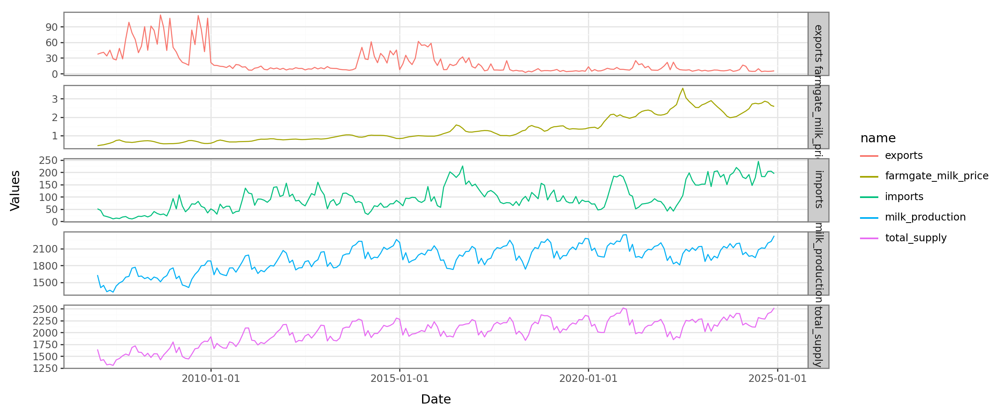
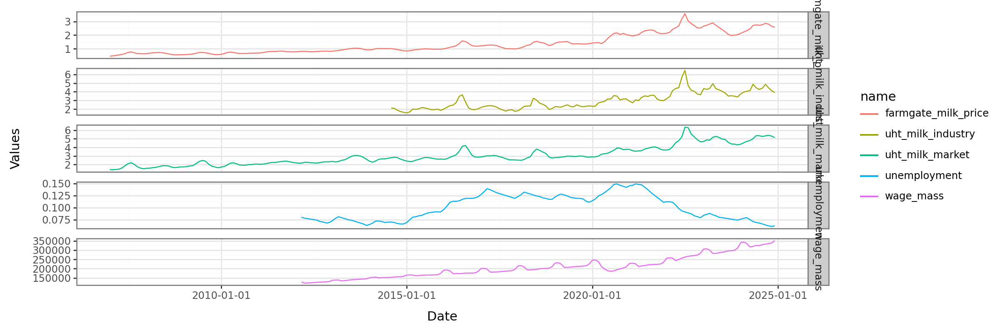
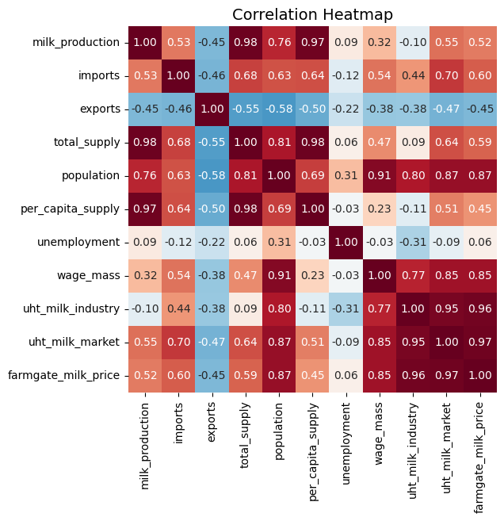
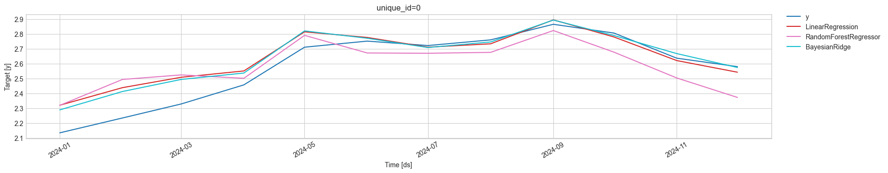
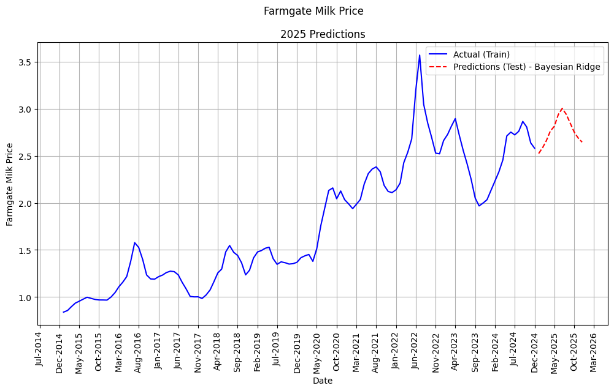

# 🥛 Milk Price Prediction Project

[](https://www.python.org/downloads/)
[](https://nixtla.github.io/mlforecast/)

> Predicting farmgate milk prices in Brazil using machine learning and time series forecasting techniques.

## 📊 Project Overview

This project focuses on predicting the **farmgate milk price** (`farmgate_milk_price`) for Brazilian milk manufacturers with a forecasting horizon of **one year**. The challenge combines time series analysis with regression modeling to understand the complex dynamics affecting milk pricing in the Brazilian market.

### 🎯 Problem Statement

Milk price prediction is crucial for:
- **Farmers** 📈 Planning production and investment decisions
- **Manufacturers** 🏭 Supply chain optimization and cost management  
- **Policy Makers** 🏛️ Market regulation and agricultural policy development
- **Investors** 💰 Risk assessment in the dairy industry

### 📊 Exploratory Data Analysis

<!-- Add your EDA images here -->



*Supply indicators showing clear trends and seasonality patterns*


*Demand indicators showing clear trends and seasonality patterns as well*


*Correlation matrix revealing relationships between variables*

## 📁 Project Structure

```
milk-prediction/
│
├── 📊 data/
│   └── tidy_data.csv                                 # Cleaned dataset
│
├── 📓 notebooks/
│   ├── 01-EDA.ipynb              # 🔍 Exploratory Data Analysis
│   ├── 02-Regression.ipynb       # 📈 Statistical regression models
│   ├── 03-ML.ipynb               # 🤖 Machine learning model validation 
│   ├── 04-ML_prediction.ipynb    # 🤖 ML Final Predictions 

│
├── 📦 pyproject.toml         # Project dependencies
├── 🔒 uv.lock               # Dependency lock file
└── 📖 README.md             # Project documentation
```

## 📈 Dataset & Features

The dataset contains monthly time series data with the following indicators:

### 🔸 Supply Indicators
- **Milk Production** 🥛 Monthly milk output volumes
- **Imports/Exports** 🌍 International trade flows
- **Total Supply** 📦 Overall market availability
- **Per Capita Supply** 👥 Supply per person metrics

### 🔸 Demand Indicators  
- **UHT Milk Industry** 🏭 Industry milk price
- **UHT Milk Market** 🛒 Market milk price
- **Unemployment Rate** 📊 Economic indicators
- **Wage Mass** 💵 Purchasing power metrics
- **Population** 👫 Demographic factors

### 🎯 Target Variable
- **Farmgate Milk Price** 💰 Price paid by producers (target for prediction)

## 🧠 Methodology

### 1. 🔍 Exploratory Data Analysis (EDA)
- **Correlation Analysis** 📊 Understanding relationships between variables
- **Trend & Seasonality** 📈 Identifying temporal patterns
- **Missing Data Assessment** ❓ Data quality evaluation

### 2. 📈 Regression Modeling
- **Linear Regression** 📏 Baseline statistical model using OLS
- **Feature Engineering** 🔧 Creating relevant predictors
- **Cross-validation** ✅ Model validation with last 12 months
- **Performance Metrics** 📊 RMSE, MAE, BIAS evaluation

### 3. 🤖 Machine Learning Approaches
Multiple algorithms were tested and compared:
- **Linear Regression** 📏 Baseline model
- **Random Forest** 🌳 Ensemble method
- **Bayesian Ridge** 🧮 Final selected model

### 4. 🔮 Covariate Forecasting
Each predictor variable was modeled separately to create future predictions:
- **Individual time series models** for each covariate
- **Univariate forecasting** approach
- **Feature-specific modeling** to capture unique patterns

## 🏆 Final Model Selection

After extensive experimentation and evaluation, the **Bayesian Ridge Regression** was selected as the final model due to:

- ✅ **Superior predictive performance** on validation data
- ✅ **Robust handling of multicollinearity** among features  
- ✅ **Uncertainty quantification** through Bayesian approach
- ✅ **Regularization benefits** preventing overfitting

## 🛠️ Tools & Technologies

### Core Libraries
- **Nixtla MLForecast** 🚀 Primary forecasting framework
- **Pandas** 🐼 Data manipulation and analysis
- **NumPy** 🔢 Numerical computing
- **Scikit-learn** 🧠 Machine learning algorithms

### Visualization & Analysis  
- **Plotnine** 📊 Grammar of graphics (ggplot2 style)
- **Matplotlib** 📈 Statistical plotting
- **Seaborn** 🎨 Statistical data visualization

### Statistical Modeling
- **Statsmodels** 📊 Statistical analysis and regression
- **UtilsForecast** ⚡ Evaluation and utility functions

## 📊 Results & Performance

### Model Comparison Results

During the model validation phase the data from 2024 was separated as the Validation Set and data from 2015 to 2023 was used as the training set with all covariates.

Below, are the results achieved with three models:

| Metric | Linear Regression | Random Forest | Bayesian Ridge |
|--------|------------------|---------------|----------------|
| **Bias** | 0.0849 | -0.0170 | **0.0677** |
| **MAE** | 0.0979 | 0.1129 | **0.0734** |
| **RMSE** | 0.1390 | 0.1281 | **0.1011** |

The **Bayesian Ridge** model demonstrated superior performance across key metrics:
- ✅ **Lowest MAE (0.0734)** 📉 Best average prediction accuracy
- ✅ **Lowest RMSE (0.1011)** 🎯 Superior overall prediction quality  
- ✅ **Moderate bias (0.0677)** ⚖️ Balanced systematic error
- ✅ **Robust generalization** 💪 Consistent performance across time periods

Below we can see the plot of the predictions on the validation set:



### 🔮 2025 Predictions

| Date | Farmgate Milk Price |
|------|---------------------|
| 2025-01-01 | 2.5245 |
| 2025-02-01 | 2.5882 |
| 2025-03-01 | 2.6609 |
| 2025-04-01 | 2.7641 |
| 2025-05-01 | 2.8132 |
| 2025-06-01 | 2.9388 |
| 2025-07-01 | 3.0034 |
| 2025-08-01 | 2.9419 |
| 2025-09-01 | 2.8464 |
| 2025-10-01 | 2.7533 |
| 2025-11-01 | 2.6891 |
| 2025-12-01 | 2.6452 |

The predictions show a **seasonal pattern** with:
- 📈 **Peak prices in mid-year** (June-July) reaching ~3.00
- 📉 **Lower prices at year start/end** (~2.52-2.65)
- 🔄 **Consistent seasonal cyclicality** reflecting market dynamics  

And the historical plot with the predictions below:



## 🚀 Getting Started

1. **Clone the repository**
```bash
git clone https://github.com/Heitorcp/milk-price-prediction.git
cd milk-price-prediction
```

2. **Install dependencies**
```bash
uv sync
```

3. **Activate virtual environment**
```bash
source .venv/bin/activate  # Linux/Mac
# or
.venv\Scripts\activate     # Windows
```

4. **Explore the analysis**
With the virtual environment set, you can access all notebooks in the folder `/notebooks` and reproduce the results.

## 📧 Contact

**Email** - [Email](heitor.c.pinheiro@hotmail.com)
**LinkedIn** - [LinkedIn](https://www.linkedin.com/in/heitor-cp/)

---
*Made with ❤️ for the Brazilian dairy industry*
